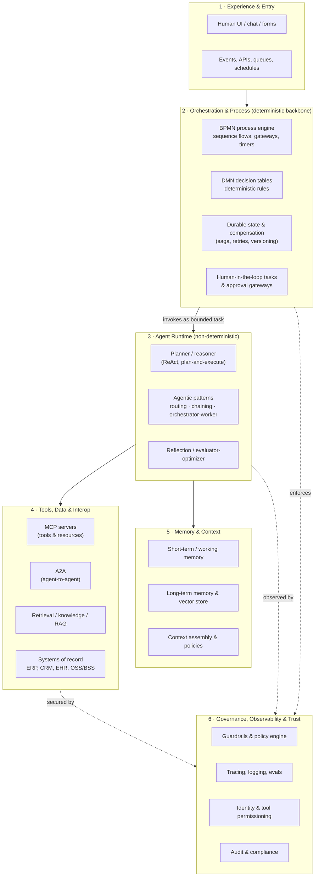
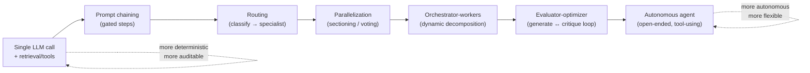
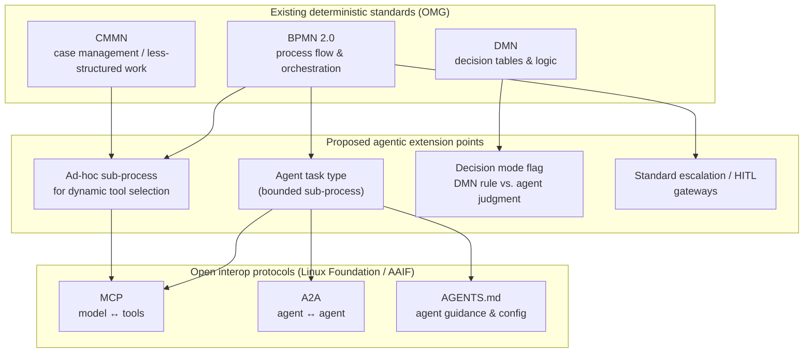
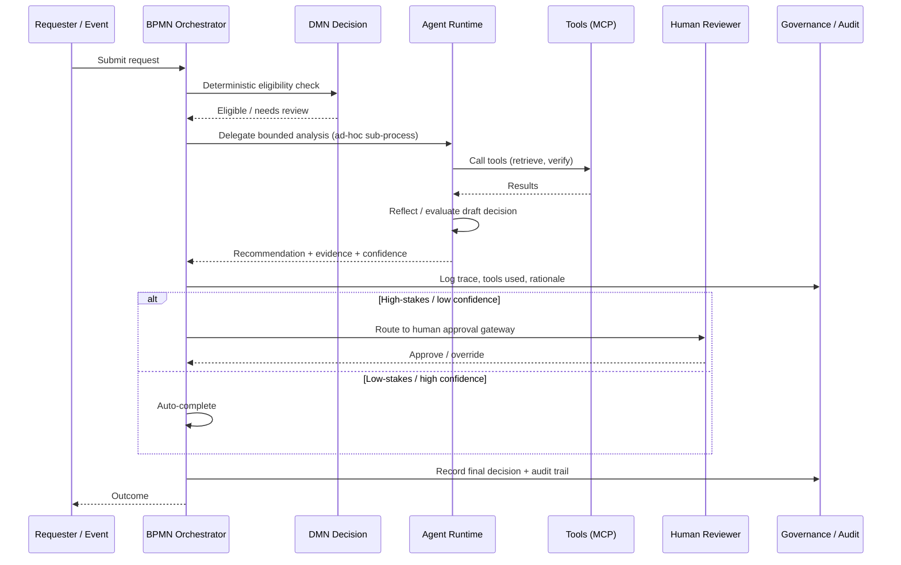

# Reference Architecture Proposal — Workflows & Processes Stream

**Agentic AI Foundation (AAIF) · Workflows and Process Integration Working Group**

*Working draft for discussion — v0.1*
*Author: Praneeth Patil (Equinix) · Date: 2026-07-27*

---

## 1. Purpose and scope

This document proposes a reference architecture for the AAIF **Workflows and Processes** stream. The goal is a vendor-neutral blueprint for building enterprise processes that combine **deterministic workflows** (traditional BPM: rules, gateways, service tasks) with **non-deterministic agentic workflows** (LLM-driven agents that plan, reason, and use tools).

The proposal deliberately positions itself as an *extension* of existing, proven workflow standards — BPMN 2.0, DMN, and CMMN from the OMG, and their implementations in engines such as Camunda and durable-execution platforms such as Temporal — rather than a greenfield replacement. AAIF's own framing is that the industry is moving "from workflow orchestration to agentic orchestration," and that the enterprise pattern is **not to replace orchestration with agents, but to augment orchestration with agents.** [Camunda; AAIF]

Scope covers four areas requested by the working group: (1) architecture patterns, (2) standards mapping, (3) cross-industry best-practice examples, and (4) governance and controls.

---

## 2. Context: why hybrid, and why now

Two market signals frame the problem.

First, **most enterprise value still lives in deterministic execution.** A widely cited rule of thumb is that roughly 80% of enterprise processes require deterministic, auditable execution, while only ~20% genuinely benefit from open-ended agent reasoning. Analyst and practitioner surveys report that the large majority of production "AI" systems are structured workflows with narrow LLM steps rather than fully autonomous agents. [Towards AI; Vellum]

Second, **the category is formalizing.** Forrester has named a hybrid market category, *Adaptive Process Orchestration* — "an automation platform that uses AI agents and nondeterministic control flows, in addition to traditional deterministic control flows, to meet business goals." This is precisely the deterministic + non-deterministic combination this stream targets. [Forrester, via IntuitionLabs]

Third, **the failure mode is architectural, not model-quality.** Gartner projects that by late 2025 fewer than 5% of enterprise applications contain real agents, and that more than 40% of agentic AI projects will be cancelled by 2027 — with **architecture misalignment cited as a primary cause.** A shared reference architecture is therefore the highest-leverage artifact this working group can produce. [Gartner, via IntuitionLabs]

---

## 3. Core concepts and definitions

To keep the stream's vocabulary aligned, the proposal adopts the following working definitions:

- **Deterministic workflow** — a process whose control flow is fixed at design time; given the same inputs it produces the same path. Modeled with BPMN sequence flows and gateways; decisions externalized to DMN. Predictable, testable, auditable.
- **Non-deterministic (agentic) workflow** — a process in which an LLM dynamically decides the next step, which tool to call, or when to stop. The control flow is discovered at run time. Flexible, but harder to test, monitor, and audit.
- **Agent** — per Camunda's working definition, "an autonomous software process that can plan, act, and reflect across systems and data sources while maintaining governance, auditability, and human oversight." Anthropic distinguishes *agents* (models direct their own process) from *workflows* (LLMs and tools orchestrated through predefined code paths). [Camunda; Anthropic]
- **Tool** — a capability the agent can invoke (an API, query, or action), typically surfaced through the **Model Context Protocol (MCP)**.
- **Orchestration** — the layer that sequences steps, manages state, enforces guardrails, and keeps humans in the loop.

---

## 4. Design principles

The reference architecture is built on seven principles distilled from the sources surveyed:

1. **Determinism by default, autonomy by exception.** Model deterministic behavior as classic process steps with DMN decisions; reserve agents for dynamic, reasoning-heavy tasks. [Camunda]
2. **Separate agent logic from tools.** A BPMN-style model lets process designers add or remove tools without rebuilding the agent, greatly improving maintainability. [Camunda / Computer Weekly]
3. **Stateful, durable execution.** Long-running agents must be backed by durable process state so they survive failures and can be resumed, migrated, and versioned. [Camunda; Temporal via IntuitionLabs]
4. **Interoperability over lock-in.** Standardize on open protocols — MCP for tools, A2A for agent-to-agent, AGENTS.md for agent guidance — so agents from different vendors and frameworks compose. [Linux Foundation / AAIF]
5. **Guardrails in two places.** Apply guardrails in both the system prompt *and* the orchestration layer; never rely on the model alone. [Camunda]
6. **Observability is not optional.** Provide full end-to-end tracing for audit trails and evaluation from day one. [Camunda; AgentCompass]
7. **Governance mapped to recognized frameworks.** Align controls to NIST AI RMF, ISO/IEC 42001, and the EU AI Act rather than inventing bespoke governance. [NIST; ISO; EU]

---

## 5. Layered reference architecture

The proposal organizes the system into six layers. Deterministic orchestration is the backbone; agentic capability is a bounded, governed component invoked from within it.

The key architectural move is that **Layer 2 (deterministic orchestration) owns the process**, and **Layer 3 (the agent runtime) is invoked as a bounded, governed step** — analogous to Camunda's model where each agent runs inside a BPMN ad-hoc sub-process that defines its available tools and reasoning steps. This preserves auditability while allowing dynamic reasoning where it adds value. [Camunda]

---

## 6. The workflow–agent spectrum and canonical patterns

Rather than a binary choice, processes sit on a spectrum from fully deterministic to fully autonomous. Anthropic's *Building Effective Agents* provides the most widely adopted vocabulary of composable patterns, and the proposal recommends adopting it as the stream's shared pattern language. [Anthropic]

The five workflow patterns — **prompt chaining, routing, parallelization, orchestrator-workers, and evaluator-optimizer** — are composable and should be preferred over fully autonomous agents wherever the task is predictable. Anthropic's guidance is explicit that many production systems need only well-engineered workflows, and that autonomy should be added only when its flexibility is genuinely required. [Anthropic]

Decision heuristic proposed for the stream:

- If the steps and decisions are known in advance → **deterministic BPMN + DMN.**
- If the path varies but the space is bounded → **workflow pattern** (routing / orchestrator-workers).
- If the task is genuinely open-ended and the number/nature of subtasks cannot be predicted → **agent**, wrapped in an orchestration boundary with guardrails and human checkpoints.

---

## 7. Standards mapping: extending BPMN / DMN / CMMN toward agentic execution

This is the heart of the stream's contribution. The proposal is to treat existing OMG workflow standards as the deterministic substrate and define standard *extension points* where agentic execution plugs in.

Mapping rationale, standard by standard:

**BPMN 2.0 → orchestration backbone.** BPMN already provides sequence flows, gateways, timers, error/compensation events, and human tasks — everything needed for durable, auditable orchestration. Camunda demonstrates the extension pattern in production: BPMN maps the flow, DMN sets decision guardrails, connectors govern tool calls, and humans step in at gateways. Each agent runs inside a **BPMN ad-hoc sub-process** that declares its available tools and reasoning steps, so the agent's autonomy is bounded by the model. The stream should standardize an **"agent task"** type and a canonical **ad-hoc-sub-process-for-tool-use** pattern. [Camunda; OMG BPMN]

**DMN → the determinism/autonomy boundary marker.** DMN is the natural place to encode the "rule vs. judgment" decision. Camunda's own guidance frames this as choosing the right abstraction: model deterministic logic as DMN decision tables; invoke an agent only for dynamic, reasoning-heavy decisions. The proposal recommends a standard **decision-mode flag** so a process can declare, per decision, whether it is resolved deterministically (DMN) or delegated to agent judgment (with the DMN table acting as a fallback / guardrail). [Camunda]

**CMMN → the model for less-structured, case-driven agent work.** CMMN was designed for knowledge work where the path is not fully predictable — a close conceptual match to agentic behavior. It is a good anchor for standardizing how agents operate over a "case file" with discretionary activities.

**MCP / A2A / AGENTS.md → the interoperability contract.** These are the AAIF- and Linux-Foundation-governed protocols that make the extension vendor-neutral: **MCP** (contributed to AAIF; the universal standard for connecting models to tools, data, and applications), **A2A** (donated by Google to the Linux Foundation in June 2025, backed by AWS, Cisco, Microsoft, Salesforce, SAP, ServiceNow; agents discover each other via *Agent Cards* and progress tasks through states such as submitted / working / completed / failed / canceled), and **AGENTS.md** (a universal standard giving agents consistent project/operational guidance). The stream should specify how MCP tool invocations and A2A agent delegations are represented and governed *inside* a BPMN process. [Linux Foundation; Google Developers Blog; AAIF]

---

## 8. Execution model: a hybrid claim example

The sequence below shows the intended interaction: deterministic orchestration drives the process, delegates a bounded reasoning task to an agent, enforces a human checkpoint for a high-stakes action, and records everything for audit.

This pattern generalizes across the industry examples in §9.

---

## 9. Cross-industry best-practice patterns

The following patterns were selected because each shows a clear division between deterministic execution and bounded agent autonomy, and each has credible reporting behind it.

### 9.1 Financial services — underwriting, claims, KYC/AML

Straight-through processing with an agentic tier: deterministic rules handle eligibility and policy checks; agents perform document analysis, evidence gathering, and draft adjudication; humans approve high-value or low-confidence cases. In insurance, specialized agents collaborate to automate low-complexity claims while keeping a human in the loop for final approval. Recent academic work explores agentic AI plus retrieval-augmented models specifically for straight-through underwriting. [Sprinklr; arXiv]

### 9.2 Healthcare — prior authorization, claims, revenue cycle

The most instructive governance example. Agentic systems can auto-process standard prior-authorization submissions, with reported processing-time reductions of 70–80% and first-pass denial reductions of 10%+ within six months for many adopters — **but** the human checkpoint is now often a legal requirement. In 2025 Texas prohibited utilization-review agents from issuing adverse determinations via automated systems without human oversight, and Arizona and Maryland adopted similar laws barring AI as the *sole* basis for a medical-necessity denial. Design implication: agents accelerate the path, humans own irreversible/adverse decisions. [Lydonia; KFF; MobiHealthNews]

### 9.3 Telecom, data centers & infrastructure — NetOps and incident response

Directly relevant to Equinix. The field is moving from rule-based SOAR toward "agentic NetOps": agents autonomously analyze telemetry, triage, and drive detection→triage→containment→recovery at machine speed. Reported outcomes include large MTTR/dwell-time reductions, and organizations using AI/automation extensively save ~$1.9M per breach and cut the breach lifecycle by ~80 days (Ponemon/IBM Cost of a Data Breach 2025). The cautionary counter-example is equally important: 2025 saw major network outages *caused* by automation tooling — reinforcing the need for guardrails and staged autonomy. The retirement of Gartner's SOAR Magic Quadrant in 2025 signals the category shift. [Vectra; Selector; SDxCentral; arXiv]

### 9.4 Manufacturing & supply chain

Deterministic MRP/planning flows augmented by agents for exception handling — demand-signal interpretation, supplier-risk reasoning, and re-planning around disruptions — with orchestration retaining control of commitments and transactions. (Pattern consistent with Adaptive Process Orchestration; treat as illustrative.)

### 9.5 IT operations & customer service

High-volume, well-understood, and forgiving of errors when bounded — the natural first landing zone. Routing and orchestrator-worker patterns triage tickets and draft resolutions; deterministic policy gates control any change that touches production or customer records.

**Common thread:** in every credible example the *irreversible or high-stakes action* stays behind a deterministic gate or a human checkpoint, while the *analysis, retrieval, and drafting* is where agent autonomy earns its keep.

---

## 10. Governance, controls and trust

Governance is a first-class layer, not an afterthought — and the AAIF has a dedicated *Governance, Risk, and Regulatory Alignment* working group plus *Observability and Traceability* and *Security and Privacy* groups this stream should align with. [AAIF]

```mermaid
flowchart LR
    subgraph RUN["Runtime controls"]
        GH["Goal & scope constraints"]
        TP["Tool permissioning & identity"]
        GR["Guardrails: prompt + orchestration"]
        HL["Human-in / on-the-loop checkpoints"]
    end

    subgraph OBSV["Observability & assurance"]
        TR["End-to-end tracing"]
        EV["Evals & offline testing"]
        MON["Drift & anomaly monitoring"]
    end

    subgraph FRME["Framework alignment"]
        NIST["NIST AI RMF\n+ GenAI Profile 600-1"]
        ISO["ISO/IEC 42001\n(AI mgmt system)"]
        EU["EU AI Act\n(high-risk: Art. 9-17)"]
        OWASP["OWASP Top 10\nfor Agentic Apps"]
    end

    RUN --> OBSV
    OBSV --> FRME
```

**Human-in-the-loop / on-the-loop.** Standardize explicit success, failure, and escalation paths, with humans placed at approval gateways for high-stakes or low-confidence actions. As §9.2 shows, this is increasingly a legal mandate, not just a best practice. [Camunda; KFF]

**Observability and evaluation.** Provide full end-to-end tracing for audit trails, plus systematic evaluation of agentic workflows in production — an active research area (e.g., AgentCompass on reliable evaluation of production agentic workflows). Because agents are non-deterministic, evaluation must be continuous, not a one-time acceptance test. [Camunda; arXiv/AgentCompass]

**Guardrails and security.** Apply guardrails in both the system prompt and the orchestration layer. The **OWASP Top 10 for Agentic Applications** adds agent-specific risks across planning, tool use, identity, memory, and inter-agent communication — for example *goal hijacking*, the agentic counterpart of prompt injection but with action consequences. Tool permissioning, memory integrity, and human oversight on destructive actions are the priority controls. [Camunda; OWASP]

**Framework alignment (layered, not redundant).** The recommended governance stack: **ISO/IEC 42001** as the certifiable management-system wrapper; **NIST AI RMF** (GOVERN / MAP / MEASURE / MANAGE) plus the **Generative AI Profile (NIST.AI.600-1, July 2024)** and the emerging community *Agentic Profile* as the operating model; **OWASP Top 10 for LLM/Agentic** as the control-level threat reference; and the **EU AI Act** as the legal backstop — where a high-risk agent inherits the full Article 9–17 stack (risk management, data governance, logging, human oversight, accuracy, robustness, cybersecurity), with tool use and memory in scope. [ISO; NIST; CSA; EU/EC Council]

---

## 11. Recommendations for the Working Group

The proposal distills to seven concrete recommendations the stream can act on:

1. **Adopt a layered reference architecture** (§5) with deterministic orchestration as the backbone and the agent runtime as a bounded, governed step.
2. **Standardize the pattern language.** Ratify Anthropic's five workflow patterns plus "autonomous agent" as the shared vocabulary, and publish the workflow-vs-agent decision heuristic (§6).
3. **Define agentic extension points for BPMN/DMN/CMMN** (§7): a standard *agent task* type, an *ad-hoc-sub-process-for-tools* pattern, a DMN *decision-mode flag*, and standard escalation/HITL gateways.
4. **Bind to open interop protocols** — MCP, A2A, AGENTS.md — and specify how tool invocations and agent delegations appear inside a process model.
5. **Mandate durable, versioned, observable execution** as a conformance requirement, not an optional feature.
6. **Publish a governance mapping** from the architecture's control points to NIST AI RMF, ISO/IEC 42001, EU AI Act, and OWASP Agentic Top 10, and coordinate with the AAIF governance/observability/security working groups.
7. **Ship reference implementations** for 2–3 cross-industry patterns (start with IT ops / NetOps given Equinix's domain, plus one regulated case such as claims or prior auth) to validate the architecture end-to-end.

---

## 12. Open questions for the stream

A few decisions the working group will need to make explicitly: how prescriptive to be about a canonical BPMN *agent task* versus leaving it engine-specific; whether to define a conformance profile and test suite; how memory and context are standardized across agents (the least mature layer today); and where the line sits between AAIF's stream and the parallel A2A track and the governance/observability working groups.

---

## References

Standards bodies, foundations & government:

- Linux Foundation — *Announces Formation of the Agentic AI Foundation (AAIF)* — https://www.linuxfoundation.org/press/linux-foundation-announces-the-formation-of-the-agentic-ai-foundation
- AAIF — *From Workflow Orchestration to Agentic Orchestration* — https://aaif.io/blog/from-workflow-orchestration-to-agentic-orchestration
- Perea.AI — *The AAIF Governance Model: Three Founding Projects, Seven Working Groups* — https://www.perea.ai/research/aaif-governance-model-2026
- Linux Foundation — *Launches the Agent2Agent (A2A) Protocol Project* — https://www.linuxfoundation.org/press/linux-foundation-launches-the-agent2agent-protocol-project-to-enable-secure-intelligent-communication-between-ai-agents
- Google Developers Blog — *Google Cloud donates A2A to Linux Foundation* — https://developers.googleblog.com/en/google-cloud-donates-a2a-to-linux-foundation/
- A2A Protocol — specification site — https://a2a-protocol.org/latest/
- NIST — *AI Risk Management Framework* — https://www.nist.gov/itl/ai-risk-management-framework
- Cloud Security Alliance — *NIST AI RMF: Agentic Profile v1* — https://labs.cloudsecurityalliance.org/agentic/agentic-nist-ai-rmf-profile-v1/
- OWASP — *Agentic Skills / Agentic Applications Top 10* — https://owasp.org/www-project-agentic-skills-top-10/
- EC-Council — *EU AI Act vs NIST AI RMF vs ISO/IEC 42001: A Plain-English Comparison* — https://www.eccouncil.org/cybersecurity-exchange/responsible-ai-governance/eu-ai-act-nist-ai-rmf-and-iso-iec-42001-a-plain-english-comparison/
- Modulos — *AI Governance Frameworks Comparison* & *OWASP Top 10 for Agentic Applications* — https://docs.modulos.ai/frameworks/comparison/index

Vendor / practitioner (patterns & orchestration):

- Anthropic — *Building Effective Agents* — https://www.anthropic.com/research/building-effective-agents
- Camunda — *Agentic Orchestration Overview (Camunda 8 Docs)* — https://docs.camunda.io/docs/components/agentic-orchestration/agentic-orchestration-overview/
- Camunda — *Essential Agentic Patterns for AI Agents in BPMN* — https://camunda.com/blog/2025/03/essential-agentic-patterns-ai-agents-bpmn/
- Camunda — *AI Agent or Rule-based DMN? Choosing the Right Abstraction* — https://camunda.com/blog/2025/07/ai-agent-or-based-rule-dmn-ai-powered-orchestration/
- Camunda — *Guardrails and Best Practices for Agentic Orchestration* — https://camunda.com/blog/2026/01/guardrails-and-best-practices-for-agentic-orchestration/
- Computer Weekly — *Camunda: BPMN as a tool for creating & orchestrating AI workflows* — https://www.computerweekly.com/blog/CW-Developer-Network/AI-workflows-Camunda-BPMN-as-a-tool-for-creating-orchestrating-AI-workflows
- Vellum — *Agentic Workflows in 2026: The Ultimate Guide* — https://www.vellum.ai/blog/agentic-workflows-emerging-architectures-and-design-patterns
- IntuitionLabs — *Agentic AI Workflows: Orchestration with Temporal* (Forrester "Adaptive Process Orchestration"; Gartner data) — https://intuitionlabs.ai/articles/agentic-ai-temporal-orchestration
- Towards AI — *AI Agents vs AI Workflows: Why 95% of Production Systems Choose Workflows* — https://pub.towardsai.net/ai-agents-vs-ai-workflows-why-95-of-production-systems-choose-workflows-b660f85adb30

Industry examples:

- Lydonia — *How Agentic AI Is Reshaping Healthcare Operations: From Prior Auth to Revenue Cycle* — https://lydonia.ai/how-agentic-ai-is-reshaping-healthcare-operations-from-prior-auth-to-revenue-cycle
- KFF — *Regulation of AI in Prior Authorization and Claims Review* — https://www.kff.org/patient-consumer-protections/regulation-of-ai-in-prior-authorization-and-claims-review-a-look-at-federal-and-state-consumer-protections/
- MobiHealthNews — *Creating a blueprint for agentic AI in claims and prior authorization* — https://www.mobihealthnews.com/news/creating-blueprint-agentic-ai-claims-and-prior-authorization
- Sprinklr — *Agentic AI in Insurance: Use Cases, Tools & Real-Life Examples* — https://www.sprinklr.com/blog/agentic-ai-in-insurance/
- Vectra AI — *Incident Response Automation: from SOAR to Agentic AI* — https://www.vectra.ai/topics/incident-response-automation
- Selector — *How Agentic AI is Redefining Network Operations* — https://www.selector.ai/blog/how-agentic-ai-is-redefining-network-operations/
- SDxCentral — *Top 5 AI stories of 2025: Agents & Automation* — https://www.sdxcentral.com/news/top-5-ai-stories-of-2025-agents-automation-genesis-gpus/

Academic / evaluation:

- *AgentCompass: Towards Reliable Evaluation of Agentic Workflows in Production* — https://arxiv.org/pdf/2509.14647
- *Agentic AI and Retrieval-Augmented Models in Straight-Through Underwriting* — https://arxiv.org/pdf/2607.07858
- *The Hitchhiker's Guide to Agentic AI: From Foundations to Systems* — https://arxiv.org/pdf/2606.24937
- *In-Context Autonomous Network Incident Response: An End-to-End LLM Agent Approach* — https://arxiv.org/pdf/2602.13156

*Note on sources: vendor blogs (Camunda, Vellum, Selector, Sprinklr, Lydonia, Vectra) reflect practitioner experience and should be read as such; analyst figures (Gartner, Forrester, IDC, Ponemon/IBM) are cited via secondary reporting and should be confirmed against the primary reports before external publication; NIST, OWASP, ISO, the EU AI Act, and the Linux Foundation/AAIF/A2A pages are primary/standards sources.*
